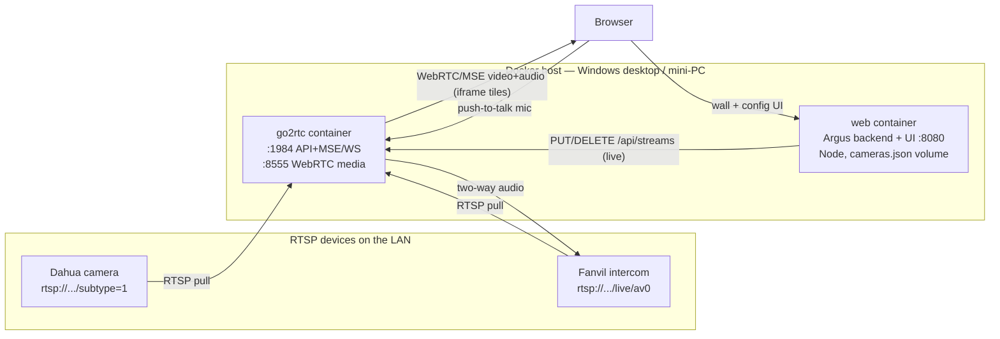
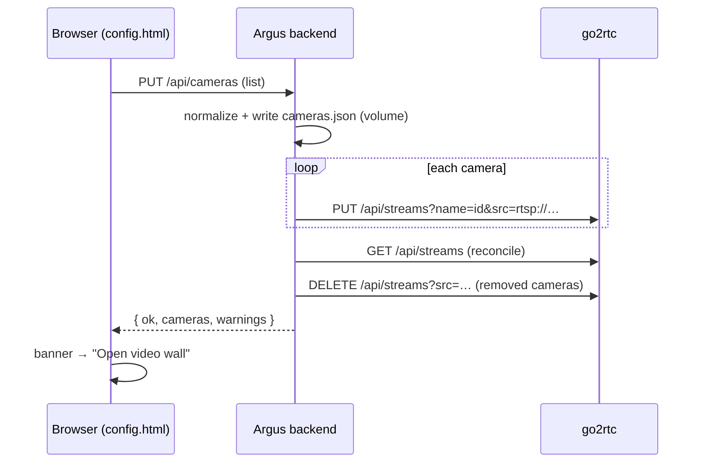

# Argus Video Wall — App Details

> **Argus** — the hundred-eyed, all-seeing watchman of Greek myth.
> A view-only RTSP video wall.

A lightweight, **view-only** video wall for RTSP cameras. Built to solve a gap in
Dahua SmartPSS: it won't let you add arbitrary RTSP devices (e.g. a Fanvil
intercom) as cameras. This app puts any set of RTSP streams onto one screen as a
low-latency grid, with audio and optional two-way talk for the intercom. Cameras
are managed entirely from the browser — no file editing. **No recording** — pure
live monitoring.

## Architecture

**Why go2rtc:** pulls each RTSP stream once and re-serves it to the browser as
WebRTC (~0.2s latency) with no transcoding (low CPU). Supports two-way audio, so
the wall can answer the Fanvil intercom. Crucially, it exposes a **stream API**
(`PUT/DELETE /api/streams`) that adds/removes cameras at runtime with no restart.

**Why a small backend:** the Node `web` service owns the camera list (name, URL,
audio/talk flags), persists it to a volume, and on save pushes it into go2rtc via
that stream API. This is what lets the config page reconfigure everything live.
It judges success by whether each stream actually registers in go2rtc, not by the
PUT status code (go2rtc creates the stream live but may 400 on its secondary
config-persist step, which we don't depend on).

**Why iframes for tiles:** each tile embeds go2rtc's own player page
(`stream.html` / `webrtc.html`). This avoids cross-origin script/CORS issues and
means go2rtc handles all codec negotiation, audio, and reconnection. The custom
frontend owns layout, labels, grid switching, mute-all, and fullscreen.

## Components

| Path | Role |
|------|------|
| `server.js` | Node backend (zero deps). Serves the UI, owns the camera list (`GET/PUT /api/cameras`), `/api/ping` identity, persists to `/data/cameras.json`, syncs go2rtc live, CORS for local cross-origin. |
| `mdns.js` | Zero-dep mDNS responder — advertises `argus.local` on the LAN so devices find the box with no IP. |
| `Dockerfile` | Builds the `web` service image (Node + `server.js` + `mdns.js` + `web/`). |
| `docker-compose.yml` | **Recommended deploy.** `go2rtc` (official image, auto-pulled) + `web` (built). `docker compose up -d --build`. |
| `go2rtc/go2rtc.yaml` | Base engine config only (api/webrtc/log). No `streams:` key — the backend manages streams at runtime. |
| `web/index.html` / `app.js` | Video wall. Fetches cameras from `/api/cameras`; tiles are go2rtc player iframes. |
| `web/config.html` / `config-ui.js` | Camera config page: add/edit/delete, Save & apply, **Detect on network**, manual backend URL. |
| `web/settings.js` | Resolves the backend + go2rtc base URLs (same-origin by default; overridable per device). |
| `web/sw.js` / `web/manifest.webmanifest` / `web/icons/` | PWA service worker (caches the app shell), manifest, and icons — installable, offline shell. |
| `web/styles.css` | Shared styling for wall + config page. |
| `tailscale-serve.sh` / `tailscale-serve.ps1` | Exposes the UI (:443) and go2rtc (:8443) over HTTPS on your private tailnet for secure remote access + a padlocked PWA install (sh = Linux/macOS, ps1 = Windows). |
| `firebase.json` / `.firebaserc` | Firebase Hosting config (project `argus-videowall`) — now serves `landing/`. Backend/video stay local. |
| `landing/` | Public landing page at argus-videowall.web.app: self-contained dark-theme page (inline CSS + SVG product mockups, no external assets), reusing the app's design tokens. Includes a self-destructing `sw.js` to migrate browsers that had installed the old hosted app shell as a PWA. |
| `deploy-hosting.sh` | Deploys `web/` to Firebase Hosting using a service-account key **by reference** (never copied/committed); refuses a key inside the repo. |
| `.gitignore` / `.dockerignore` | Block service-account keys and other secrets from ever being committed or entering the image. |
| `licensing.js` | Subscription enforcement: 2 cameras free, Ed25519-signed keys (verified offline against the embedded public key) raise the limit. Named `licensing` — `require("./license")` would hit the `LICENSE` text file on case-insensitive filesystems. |
| `tools/license-sign.js` | CLI to issue keys (`--email --extra N [--months M]`); signs with the private key kept OUTSIDE the repo (`~/Documents/Wiltech/argus-license-keys/`). |
| `docs/monetisation.md` | Runbook: pricing model, key issuing, PayPal plan setup, automation roadmap, licensing caveat. |
| `start-windows.bat` / `start-macos.sh` | Non-Docker manual run (needs Node + a downloaded go2rtc binary; visible windows). |
| `setup-windows.bat` / `setup-windows.ps1` | **No-Docker Windows install.** Installs Node (winget) + go2rtc if missing, opens firewall (group "Argus"), registers the "Argus Video Wall" scheduled task to run at every boot as SYSTEM — silent, no login needed. Re-runnable. |
| `run-argus.ps1` | Headless supervisor the boot task runs: waits for the LAN, starts go2rtc + `server.js` hidden, restarts either on crash, logs to `logs\`. |
| `uninstall-windows.bat` / `uninstall-windows.ps1` | Complete uninstall: stops everything, deletes the boot task + firewall rules, tears down the Docker deployment if present, and (on confirm) deletes the whole folder incl. saved cameras. |

## Data flow — saving cameras

## Security posture

**Processing is local; video and metadata never touch a cloud.** RTSP reading,
stream rendering, and camera config all run on the box. The frontend bundles no
third-party scripts, fonts, CDNs, or Firebase SDK, and at runtime calls only the
local/tailnet backend (the only non-loopback reference in code is the internal
`go2rtc` container name).

The UI can be served two ways:
- **From the box (default):** nothing external at all.
- **Firebase Hosting (optional):** Google serves only the static UI *files*.
  There is no Firebase SDK and no data path to Google — camera config and video
  still flow browser ↔ box (over Tailscale HTTPS). Google sees request metadata
  for the file download (your IP/timing), nothing more.

**Secret handling:** the Firebase Admin SDK service-account key is never stored
in the repo or Docker image. `deploy-hosting.sh` consumes it by reference (via
`GOOGLE_APPLICATION_CREDENTIALS`) and refuses a key placed inside the project;
`.gitignore`/`.dockerignore` block common key filenames as defense in depth.

Remote access is via Tailscale — a private, WireGuard-encrypted mesh — not public
port-forwarding.

## Remote access (optional, Tailscale)

`tailscale-serve.sh` runs `tailscale serve` on the box to publish:
- `https://<box>.<tailnet>.ts.net` → the UI + backend (:8080)
- `https://<box>.<tailnet>.ts.net:8443` → go2rtc (:1984)

Both get valid auto-renewed certs, so the PWA installs and the streams load with
no mixed-content issues, reachable only by devices on your tailnet. `settings.js`
derives go2rtc's URL from the backend host (`https → :8443`, `http → :1984`), so
the same frontend works locally and over Tailscale unchanged.

## Discovery (finding the box from another device)

When the UI is served from the box it's same-origin — no discovery needed. For a
device that didn't load it from the box, the config page's **Detect on network**
probes a small candidate set (`argus.local`, `localhost`, current origin, and
previously-used URLs) via `/api/ping` and auto-attaches to the one that answers.
A browser cannot scan the whole subnet (blocked by Private Network Access + no
subnet visibility), so Argus relies on the `argus.local` mDNS name plus this
targeted probe rather than a full sweep.

## Features

- Browser-based camera management (add/edit/delete RTSP URLs), applied live on
  save — no restart, no file editing.
- **Installable PWA** — app-shell cached by a service worker; opens instantly and
  works offline (streams need the box, naturally).
- **Detect on network** — one-click attach to the local box via `argus.local`.
- Grid layouts: 1×1, 2×2, 2×3, 3×3, 4×4 (live-switchable, remembered per browser).
- Per-tile **listen** (🔊) and, for the intercom, **push-to-talk** (🎙).
- Mute-all, per-tile fullscreen, whole-wall fullscreen.
- Per-camera **Test** button (opens the stream in go2rtc) to confirm a URL works.
- Auto-reconnect (handled by go2rtc's player).

## Known constraints

- **Two-way talk needs a secure context.** Browsers only allow microphone
  capture over `https://` or `localhost`. Listening works over plain LAN HTTP;
  talking from another machine over a bare LAN IP needs HTTPS in front of go2rtc.
- **Fanvil RTSP path varies by model/firmware** — confirm in the device web UI
  (Intercom → RTSP) or datasheet. Test URLs in VLC/ffprobe before adding them.
- **WebRTC in Docker** (bridge networking) needs `webrtc.candidates` set to the
  host LAN IP in `go2rtc.yaml`; until then tiles use go2rtc's MSE fallback
  (~0.5–1s latency) over port 1984, which works with zero configuration.
- **`argus.local` needs multicast to reach the LAN** — that means host networking
  (Linux hosts / mini-PC / NAS; see `docker-compose.yml`). On Docker Desktop
  (Windows/Mac) mDNS may not reach the physical LAN; use the box IP, `localhost`
  on the same machine, or a Tailscale name (Detect still finds those).
- **PWA install / service worker need a secure context** — `localhost` or HTTPS
  (Tailscale). Over a plain `http://<LAN-IP>` the app still runs but won't install
  or cache offline.
- No recording, no motion detection, no authentication on the wall page by
  design (it's a private-network appliance). Tailscale + its ACLs / Cloudflare
  Access are the intended access-control layer if you go beyond the LAN.

## Changelog

### 2026-07-14 (later)
- **Monetisation: 2 cameras free, $2/camera/month via PayPal + offline license
  keys.** New `licensing.js` (Ed25519-verified `ARGUS.…` keys, embedded public
  key, private key outside the repo) and `tools/license-sign.js` issuer.
  Backend: `PUT /api/cameras` returns 402 `license_limit` above the limit;
  boot sync registers only the licensed slice (never deletes);
  `GET/PUT/DELETE /api/license` endpoints. Config page: License section
  (status + paste-key activate) and a friendly 402 banner. Landing page:
  Pricing section + copy updated from "free/MIT" to freemium (not redeployed —
  site intentionally offline). `docs/monetisation.md` runbook covers PayPal
  plan setup (quantity-based $2 plan), key policy, automation roadmap, and the
  open MIT-relicensing decision. Verified end-to-end: free-tier 402 → key
  activation (limit 5, +5d grace) → save OK → tampered/expired keys rejected →
  key removal reverts. Gotcha fixed: `require("./license")` resolved to the
  `LICENSE` text file on macOS.
- **Camera list can be minimised outside fullscreen** (field request — walls are
  often used windowed). Added a visible `«` collapse button on the panel header
  (the toolbar `☰` and the `[` key already toggled it, but weren't obvious),
  and the collapsed/expanded choice now persists per browser via
  `localStorage("argus.sidebar.collapsed")`, restored on load. Touched
  `web/index.html`, `web/app.js`, `web/styles.css`.
- **Landing page at argus-videowall.web.app.** Firebase Hosting now serves a new
  `landing/` site instead of the app shell: hero with an SVG video-wall mockup,
  stats, feature grid, config-page/talk mockups, how-it-works architecture
  diagram, install cards (Windows no-Docker recommended path + Docker), privacy
  section with a Tailscale diagram, FAQ. Fully self-contained (no CDNs/fonts,
  matching the project's no-external posture), same design tokens as the app.
  `landing/sw.js` self-destructs the old hosted PWA's service worker/caches.
  Deployed. Note: the GitHub links point at the private repo — make it public
  (or swap links) for visitors to be able to download.
- **setup-windows.ps1 hardening** after a field report (task not registered, no
  visible error): whole body in try/catch so the elevated window never closes
  silently, `Start-Transcript` → `setup.log`, task registration verified via
  `Get-ScheduledTask`, `/api/ping` polled to confirm Argus answers, and the
  execution-time-limit set via the settings property (`PT0S`) because
  `-ExecutionTimeLimit ([TimeSpan]::Zero)` is rejected on some Windows builds
  (default 72h limit would kill Argus). Boot-delay set best-effort. Setup now
  also seeds `data\cameras.json` so the config file visibly exists. `logs/` +
  `setup.log` gitignored; uninstall removes `setup.log` too.
- **Second field report** (task registered OK, but the `/api/ping` poll timed
  out): verification now uses a raw `TcpClient` connect — PS 5.1's
  `Invoke-WebRequest` can time out on `localhost` behind a system proxy with no
  local bypass, so HTTP was the wrong probe. Setup also pre-warns when
  8080/1984/8555 are held by a foreign process and, on failure, auto-prints
  task state/last result, running processes, and log tails into `setup.log`.
  `run-argus.ps1` writes a timestamped `logs\supervisor.log` (start, PIDs,
  restarts) and both scripts `Unblock-File` the downloaded go2rtc exes
  (mark-of-the-web can block background launches under some AV policies).
- **Third field report (parse errors on PS 5.1):** all `.ps1` files are now
  saved as UTF-8 **with BOM**. PS 5.1 reads BOM-less files as ANSI, so an em
  dash in a string decoded into a curly double-quote — a string delimiter to
  PS 5.1 — cascading into bogus parse errors (pwsh 7 parse checks passed
  because it assumes UTF-8). Em dashes in scripts replaced with hyphens too.
  Rule for this repo: **.ps1 files must be UTF-8 with BOM, and keep string
  literals ASCII-only.**

### 2026-07-14
- **Windows start-at-boot + full uninstall (no-Docker path).** Added
  `setup-windows.ps1` (+ double-click `.bat` wrapper): installs Node via winget
  if missing, downloads go2rtc, adds inbound firewall rules (group "Argus":
  8080/1984/8555 TCP, 8555/5353 UDP) so the wall is reachable from the LAN, and
  registers an "Argus Video Wall" scheduled task — runs `run-argus.ps1` at every
  boot as SYSTEM, completely silent (no consoles, no login required). The runner
  waits for the network, supervises go2rtc + `server.js` (auto-restart on
  crash), and logs to `logs\`. Added `uninstall-windows.ps1` (+ `.bat`): stops
  all processes, removes the task and firewall rules, tears down the Docker
  deployment if present (`compose down -v --rmi local`), and optionally deletes
  the entire folder (self-deleting via a detached `cmd`). README updated.
- **`tailscale-serve.ps1`** — Windows equivalent of `tailscale-serve.sh`, added
  because the PWA shows "Not secure" (and won't use the mic) over plain
  `http://<LAN-IP>`: browsers only grant a secure context to `https://` or
  `localhost`. Publishing via Tailscale HTTPS gives a valid cert and a clean
  PWA install from `https://<box>.<tailnet>.ts.net`.
- Named the project **Argus**; renamed the project folder from `customNVR`.
- Initial scaffold. Chose go2rtc as the streaming engine and an iframe-per-tile
  frontend after confirming go2rtc serves embeddable `stream.html` /
  `webrtc.html` players and supports two-way audio for the Fanvil intercom.
- Added `go2rtc/go2rtc.yaml` (Dahua + Fanvil placeholders with RTSP-URL guidance),
  `web/` video-wall UI (grid switching, listen, push-to-talk, fullscreen,
  mute-all), and Windows/macOS launch scripts.
- Documented architecture (Mermaid), components, features, and constraints.
- Added Docker deployment (`docker-compose.yml`): `alexxit/go2rtc` (auto-pulled)
  + nginx serving the wall, so install is `docker compose up -d` with no binary
  download. Frontend `go2rtcHost` now defaults to `"auto"` (uses the page's own
  hostname:1984), so the wall works from any LAN device without editing config.
- **Browser-managed cameras.** Replaced the static nginx service and
  `web/config.js` with a zero-dependency Node backend (`server.js`, built via
  `Dockerfile`) that owns the camera list, persists it to an `argus-data` volume
  (`cameras.json`), and syncs go2rtc live via its `PUT/DELETE /api/streams` API.
  Added a config page (`web/config.html` + `config-ui.js`) to add/edit/delete
  cameras and Save & apply; the wall now fetches cameras from `GET /api/cameras`.
  Removed the static `streams:` block from `go2rtc.yaml` (an empty `streams: {}`
  breaks go2rtc's config patcher and caused HTTP 400 on stream PUTs).
- Verified end-to-end against go2rtc 1.9.14: boot-sync, add, and remove all
  reflect correctly in `GET /api/streams`; save returns `ok:true` with no
  spurious warnings. Start scripts updated to launch the Node backend.
- **PWA + self-hosted, network-only posture.** Made the UI installable
  (`manifest.webmanifest`, `sw.js` app-shell cache, generated eye icons) and
  confirmed the frontend makes no external calls. Added `settings.js` to resolve
  backend/go2rtc base URLs (same-origin by default; per-device override), and
  CORS on the backend for local cross-origin use. Decided against Firebase
  hosting so nothing — not even the static UI — is served off-network.
- **Local discovery.** Added `/api/ping` + a zero-dep mDNS responder (`mdns.js`)
  advertising `argus.local`, and a **Detect on network** button that probes
  `argus.local`/`localhost`/origin/history and auto-attaches. Documented that a
  browser can't scan the subnet, so discovery is name + targeted-probe based.
  Verified the mDNS responder answers a real query (`argus.local → <LAN IP>`).
- **Secure remote access.** Added `tailscale-serve.sh` to publish the UI (:443)
  and go2rtc (:8443) over private-tailnet HTTPS, keeping cameras off the public
  internet while satisfying the browser's secure-context / mixed-content rules.
- **Optional Firebase Hosting for the UI shell** (revisiting the earlier
  drop-Firebase decision at the user's request — hosting was set up on their
  side). Added `firebase.json` (serves `web/`, project `argus-videowall`),
  `.firebaserc`, and `deploy-hosting.sh`. Only static files are hosted; the
  frontend bundles no Firebase SDK and all video/config stay browser ↔ local box
  over Tailscale HTTPS (required — an HTTPS page can't reach a plain-http LAN
  backend). The `settings.js` backend-override + CORS added earlier make this
  work unchanged.
- **Secret hygiene.** The Firebase Admin SDK key is treated as a secret: never
  stored in the repo/image; `deploy-hosting.sh` uses it by reference and rejects
  a key inside the project folder; `.gitignore`/`.dockerignore` block key
  filenames. Only the non-secret `project_id` (`argus-videowall`) was read to
  configure hosting.
